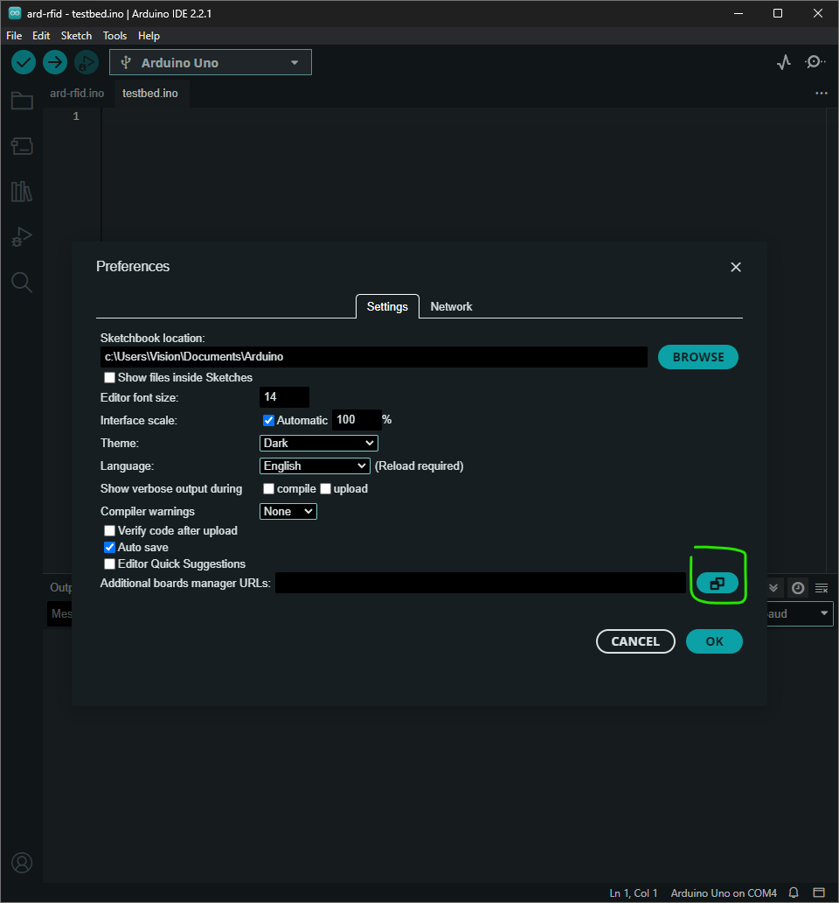
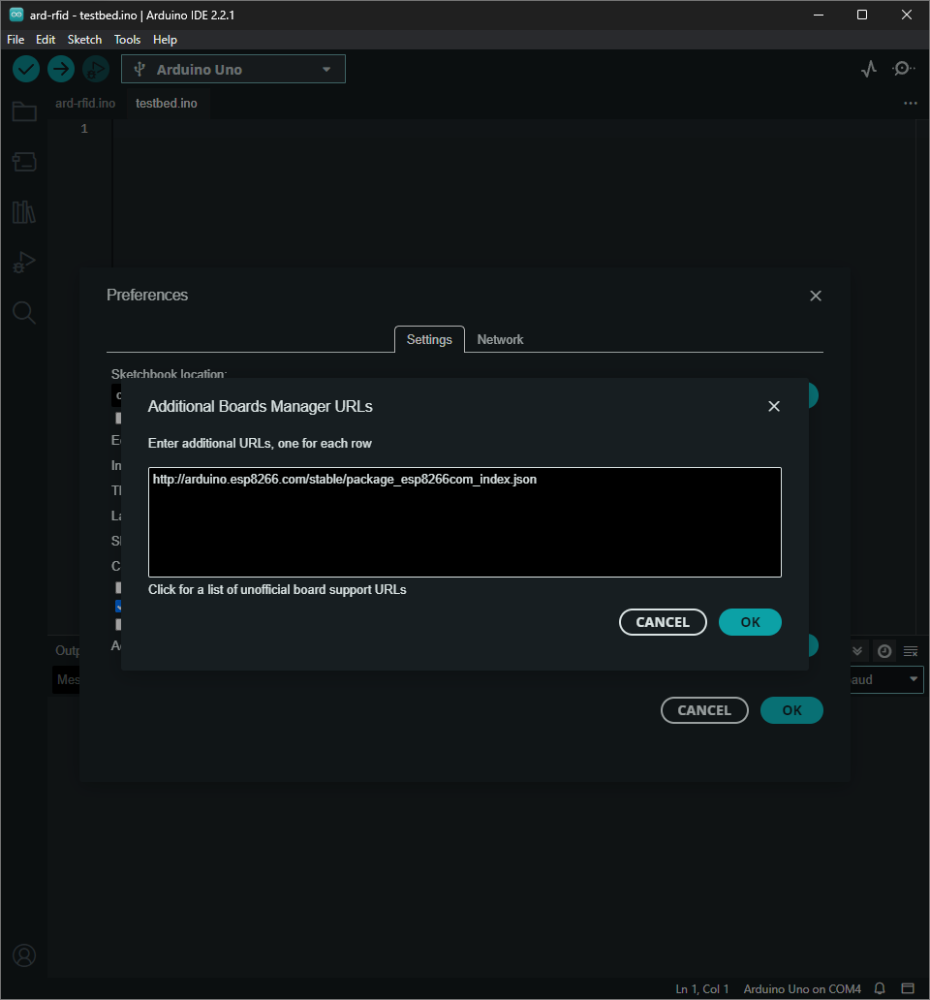
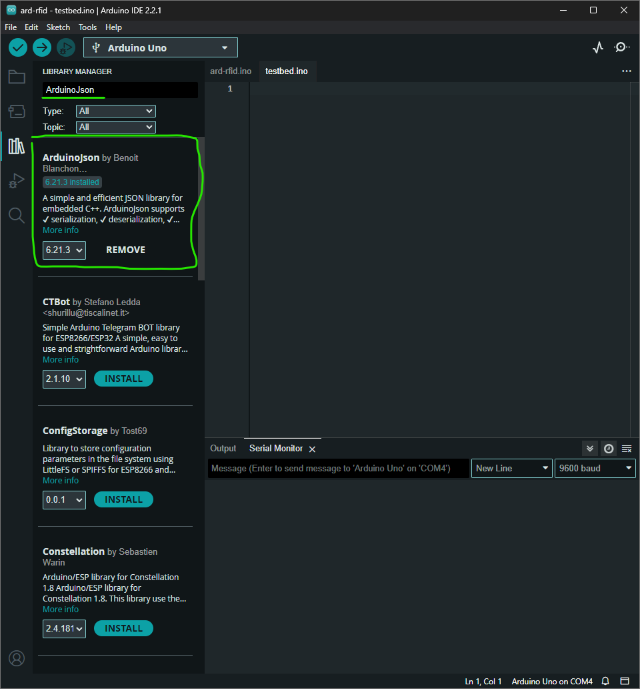
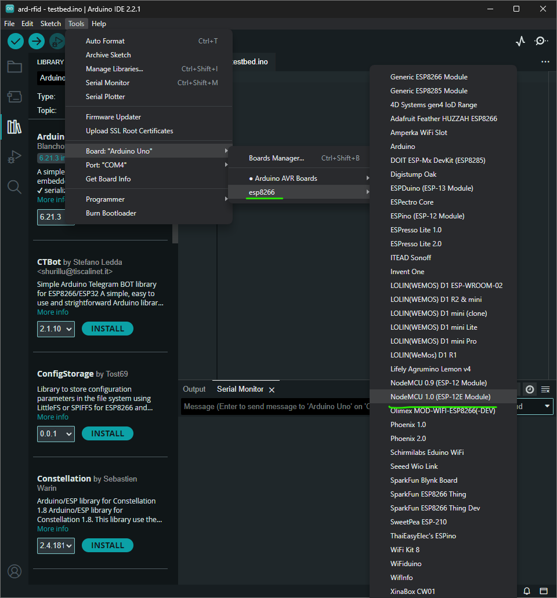

# Setup Instruction

1. Register ESP8266 Board Manager into Arduino IDE with following steps.

    a. Open `File`->`Preferences...`.

    b. Click manage board manager URLs on Preferences window.
    

    c. Add `http://arduino.esp8266.com/stable/package_esp8266com_index.json` into Additional Board Manager URLs.
    

    d. Click OK on Additional Board Manager URLs window and Preferences window. Wait for the installation completed.

2. On [`Tools`->`Manage Libraries...`], install [Arduinojson](https://arduinojson.org/) library using Library Manager.

3. Connect ESP8266 board into PC and select correct `COM` port.

    a. Ensure correct board were selected after plugging in ESP8266 by selecting `Tools`->`Board`->`esp8266`->`NodeMCU 1.0 (ESP-12E Module)`
    

    b. Make sure correct `COM` port selected

4. Make required adjustment over `ssid`, `password`, and `url` constants in `esp8266.ino` file.

5. Compile, Verify, and Upload code into ESP8266.

6. (Optional) Open `Tools`->`Serial Monitor` at baud rate `9600` to debug ESP8266.
