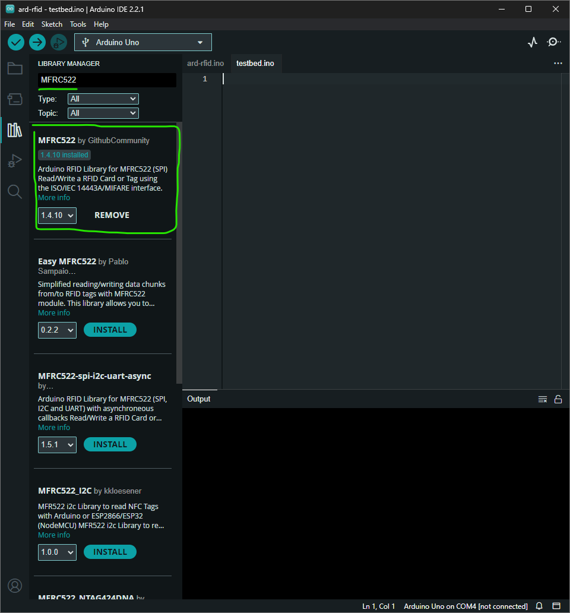
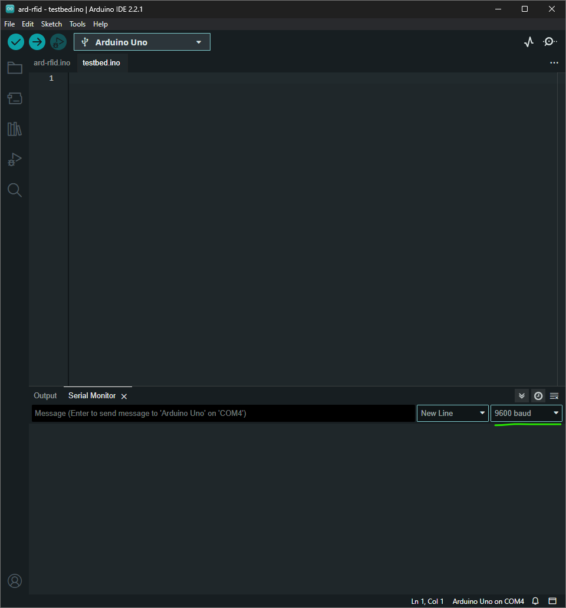

# Setup Instruction

1. On [`Tools`->`Manage Libraries...`], install [MFRC522](https://github.com/miguelbalboa/rfid) library using Library Manager.

2. Connect Arduino Uno board into PC and select correct `COM` port.

3. Verify and Compile source code.

4. Upload code into Arduino Uno.

5. (Optional) Open `Tools`->`Serial Monitor` at baud rate `9600` to debug Arduino Uno.

